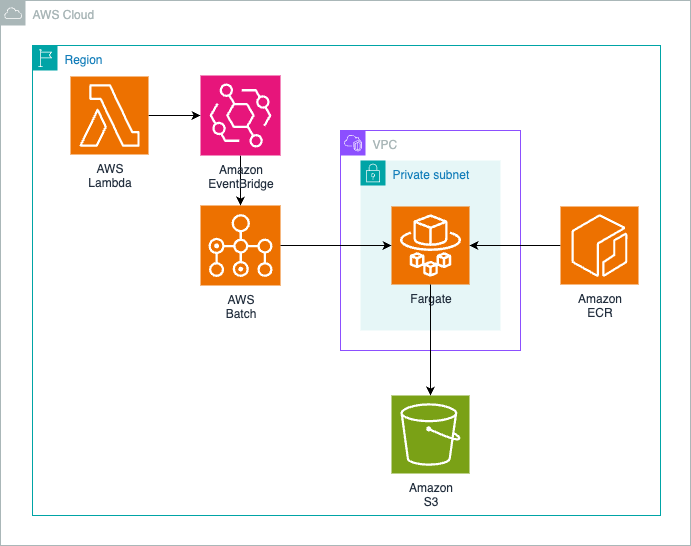

# 🚀 Event-Driven Selenium Testing with AWS Batch and Fargate

**Serverless, event-driven batch processing workflow for running containerized Selenium browser tests on AWS.**

Perfect for organizations needing scalable, automated browser testing without managing infrastructure.

---

> **Note:** This sample code is provided for demonstration purposes and should be reviewed and tested thoroughly before use in production environments. Ensure compliance with your organization's security policies.

---

## 📋 Table of Contents

- [Overview](#overview)
- [Architecture](#architecture)
- [Prerequisites](#prerequisites)
- [Quick Start](#quick-start)
- [Project Structure](#project-structure)
- [Configuration](#configuration)
- [Testing](#testing)
- [Troubleshooting](#troubleshooting)
- [Limitations](#limitations)
- [Security](#security)
- [Cost Estimates](#cost-estimates)
- [Contributing](#contributing)
- [License](#license)
- [Resources](#resources)

---

## Overview

### What This Does

Builds a serverless, event-driven batch processing workflow for running containerized Selenium browser tests on AWS. A Lambda function receives test requests and publishes events to Amazon EventBridge, which triggers AWS Batch jobs running on Fargate.

```ini
Lambda → EventBridge → AWS Batch → Fargate Container → S3 Report
```

### Key Components

- **AWS Lambda** - Event trigger and orchestration
- **Amazon EventBridge** - Event routing and pattern matching
- **AWS Batch** - Job scheduling and management
- **AWS Fargate** - Serverless container execution
- **Amazon ECR** - Container image registry
- **Amazon S3** - Test report storage
- **Amazon VPC** - Network isolation with private subnets
- **Terraform** - Infrastructure as Code

### Workflow

1. Lambda receives a `runId` and publishes an event to EventBridge
2. EventBridge rule matches the event pattern and triggers an AWS Batch job
3. Fargate container runs Selenium tests with headless Chromium
4. Test report (HTML) is uploaded to S3

---

## Architecture



### Network Architecture

- **VPC** with private subnets (no NAT Gateway)
- **VPC Endpoints** for ECR, S3, CloudWatch Logs
- **Security Groups** with least privilege access
- **No internet access** - all communication via VPC endpoints

---

## Prerequisites

### Required Software

- **Terraform** >= 1.0
- **AWS CLI** configured with appropriate credentials
- **Docker** for building container images
- **Git** for version control

### AWS Permissions Required

Your AWS credentials need permissions for:

- VPC (create/manage VPCs, subnets, endpoints)
- Lambda (create/manage functions)
- EventBridge (create/manage rules)
- AWS Batch (create/manage compute environments, job queues, job definitions)
- S3 (create/manage buckets)
- IAM (create/manage roles and policies)
- ECR (create/manage repositories, push images)
- CloudWatch (create/manage log groups)

---

## Quick Start

### 1. Clone the Repository

```bash
git clone https://github.com/aws-samples/sample-aws-batch-fargate-selenium-tests.git
cd sample-aws-batch-fargate-selenium-tests
```

### 2. Deploy Infrastructure

```bash
terraform init
terraform apply
```

### 3. Build and Push Container Image

```bash
./scripts/build-image.sh
```

### 4. Test the Workflow

Invoke the Lambda function:

```bash
aws lambda invoke \
  --function-name batch-demo-trigger-function \
  --payload '{"body":{"runId":"test123"}}' \
  response.json
```

### 5. Verify Results

Get the S3 bucket name from Terraform outputs:

```bash
export BUCKET_NAME=$(terraform output -raw s3_bucket_name)
echo "S3 Bucket: $BUCKET_NAME"
```

Check the S3 bucket for the test report:

```bash
aws s3 ls s3://$BUCKET_NAME/test_reports/runjobrunId-test123/
```

Download the report:

```bash
aws s3 cp s3://$BUCKET_NAME/test_reports/runjobrunId-test123/report.html ./
```

---

## Project Structure

```ini
sample-aws-batch-fargate-selenium-tests/
├── main.tf                    # Root module composition
├── variables.tf               # Input variables
├── outputs.tf                 # Output values
├── provider.tf                # AWS provider configuration
├── data.tf                    # Data sources
├── modules/
│   ├── vpc/                   # VPC with private subnets and VPC endpoints
│   │   ├── main.tf
│   │   ├── variables.tf
│   │   └── outputs.tf
│   ├── ecr/                   # ECR repository for container images
│   │   ├── main.tf
│   │   ├── variables.tf
│   │   └── outputs.tf
│   └── batch/                 # Batch, Lambda, EventBridge, S3, IAM
│       ├── main.tf
│       ├── variables.tf
│       └── outputs.tf
├── app/                       # Container application (Selenium tests)
│   ├── dockerfile             # Container image definition
│   ├── run.sh                 # Container entrypoint script
│   ├── test_sample.py         # Selenium test script
│   ├── upload_to_s3.py        # S3 upload utility
│   └── upload_to_s3.sh        # S3 upload wrapper
├── scripts/
│   └── build-image.sh         # Docker build and push script
├── README.md                  # This file
├── CONTRIBUTING.md            # Contribution guidelines
├── CODE_OF_CONDUCT.md         # Code of conduct
├── SECURITY.md                # Security policy
└── NOTICE                     # Legal notices
```

---

## Configuration

### Terraform Variables

| Variable | Description | Default | File |
|----------|-------------|---------|------|
| `region` | AWS region | `eu-west-1` | [variables.tf](variables.tf) |
| `project` | Project name prefix | `batch-demo` | [variables.tf](variables.tf) |
| `image_tag` | Container image tag | `latest` | [variables.tf](variables.tf) |
| `job_definition_vcpu` | vCPU allocation | `0.5` | [variables.tf](variables.tf) |
| `job_definition_memory` | Memory (MB) | `1024` | [variables.tf](variables.tf) |

### Container Configuration

The Selenium test container is defined in [app/dockerfile](app/dockerfile):

```dockerfile
FROM python:3.11-slim
# Installs Chromium, ChromeDriver, Selenium, and test dependencies
```

Test script: [app/test_sample.py](app/test_sample.py)

- Runs headless Chromium tests
- Generates HTML report
- Uploads to S3

### Lambda Configuration

Lambda function code is inline in modules/batch/lambda.tf:

- Receives `runId` from event payload
- Publishes event to EventBridge
- Returns success/failure response

---

## Testing

### Manual Testing

**1. Invoke Lambda with Test Event:**

```bash
aws lambda invoke \
  --function-name batch-demo-trigger-function \
  --payload '{"body":{"runId":"manual-test-001"}}' \
  response.json

cat response.json
```

**2. Monitor Batch Job:**

```bash
# List jobs
aws batch list-jobs --job-queue batch-demo-job-queue

# Describe specific job
aws batch describe-jobs --jobs <JOB_ID>
```

**3. Check CloudWatch Logs:**

```bash
# Lambda logs
aws logs tail /aws/lambda/batch-demo-trigger-function --follow

# Batch job logs
aws logs tail /aws/batch/job --follow
```

**4. Retrieve Test Report:**

```bash
# Get bucket name from Terraform
export BUCKET_NAME=$(terraform output -raw s3_bucket_name)

# Download report
aws s3 cp s3://$BUCKET_NAME/test_reports/runjobrunId-manual-test-001/report.html ./
open report.html  # macOS
```

### Automated Testing

Run multiple concurrent tests:

```bash
for i in {1..5}; do
  aws lambda invoke \
    --function-name batch-demo-trigger-function \
    --payload "{\"body\":{\"runId\":\"test-$i\"}}" \
    response-$i.json &
done
wait
```

---

## Troubleshooting

### Common Issues

**1. Job Stuck in RUNNABLE State**

```bash
# Check compute environment status
aws batch describe-compute-environments \
  --compute-environments batch-demo-compute-env

# Common causes:
# - VPC endpoints not configured correctly
# - Security group blocking egress
# - Insufficient Fargate capacity (rare)
```

**Solution:**

- Verify VPC endpoints in [modules/vpc/main.tf](modules/vpc/main.tf)
- Check security group rules allow HTTPS (443) egress

**2. CannotPullContainerError**

```bash
# Verify image exists in ECR
aws ecr describe-images --repository-name batch-demo-repo
```

**Solution:**

```bash
# Rebuild and push image
./scripts/build-image.sh
```

**3. Tests Timeout on External URLs**

The VPC has no NAT Gateway, so external URLs are unreachable.

**Solution:**

- Use `data:` URLs for testing (see [app/test_sample.py](app/test_sample.py))
- Or add NAT Gateway to VPC (increases cost)

**4. S3 Upload Fails**

```bash
# Check job role permissions
aws iam get-role-policy \
  --role-name batch-demo-job-role \
  --policy-name batch-demo-job-policy
```

**Solution:**

- Verify S3 bucket name using `terraform output s3_bucket_name`
- Ensure job role has `s3:PutObject` permission

**5. Lambda Invocation Fails**

```bash
# Check Lambda logs
aws logs tail /aws/lambda/batch-demo-trigger-function --follow
```

**Solution:**

- Verify EventBridge permissions in Lambda execution role
- Check event payload format

---

## Limitations

| Limitation | Description | Impact | Workaround |
|------------|-------------|--------|------------|
| **Batch Job Submission Limits** | AWS Batch has limits on jobs per compute environment | High event volumes may cause submission failures | Implement queue throttling or use multiple compute environments |
| **Container Overrides** | runId passed via environment variable overrides | Misconfiguration prevents correct runId delivery | Ensure EventBridge target configuration matches job definition |
| **EventBridge Rule Limits** | Limits on pattern complexity and rule count | Complex patterns unsupported; management overhead | Simplify event patterns or use multiple rules |
| **No Internet Access** | Private subnets without NAT Gateway | Tests must use local/data URLs, not external sites | Add NAT Gateway (increases cost ~$32/month) or use VPC endpoints |
| **Single Region** | Deployed to one region only | Cross-region testing not supported | Deploy separate stacks per region |
| **Fargate Spot Not Supported** | Batch Fargate doesn't support Spot pricing | Higher compute costs | Use EC2 compute environment with Spot instances |

---

## Security

### Security Best Practices Implemented

✅ **Network Isolation:**

- Private subnets with no internet gateway
- VPC endpoints for AWS service access
- Security groups with least privilege rules

✅ **Encryption:**

- S3 bucket encrypted with KMS
- ECR images encrypted with AES256
- Data in transit via TLS 1.2+

✅ **Access Control:**

- IAM roles with least privilege policies
- S3 bucket blocks public access
- ECR repository has lifecycle policies

✅ **Logging & Monitoring:**

- CloudWatch logs for Lambda and Batch jobs
- Log retention policies configured
- VPC Flow Logs (optional, can be enabled)

✅ **Image Security:**

- ECR image scanning enabled
- Immutable image tags
- Lifecycle policies to remove old images

### Security Configuration Files

- IAM policies: modules/batch/iam.tf
- Security groups: modules/vpc/main.tf
- S3 configuration: modules/batch/s3.tf
- ECR repository: modules/ecr/main.tf

### Production Security Checklist

When moving to production:

- [ ] Enable VPC Flow Logs
- [ ] Configure AWS Config rules
- [ ] Set up CloudWatch alarms for failed jobs
- [ ] Enable AWS Security Hub
- [ ] Implement secrets management for sensitive data
- [ ] Configure S3 bucket logging
- [ ] Enable ECR image scanning on push
- [ ] Review and restrict IAM policies further
- [ ] Implement network firewall rules
- [ ] Set up AWS GuardDuty

---

## Cost Estimates

### Monthly Costs (100 test runs, 2 min avg duration, single AZ)

| Component              | Cost Model                                  | Estimated Monthly Cost         |
|------------------------|---------------------------------------------|--------------------------------|
| **Fargate**            | $0.04048/vCPU-hour + $0.004445/GB-hour      | ~$0.10 (100 jobs × 2 min avg)  |
| **VPC Endpoints**      | $0.01/hour per interface endpoint × 6       | ~$44 (single AZ)               |
| **S3 Gateway Endpoint**| Free                                        | $0                             |
| **Lambda**             | First 1M requests free, then $0.20/1M       | $0 (under free tier)           |
| **ECR Storage**        | $0.10/GB-month                              | ~$1                            |
| **S3 Storage**         | $0.023/GB-month                             | ~$1                            |
| **CloudWatch Logs**    | $0.50/GB ingested                           | ~$1                            |
| **Data Transfer**      | Within VPC via endpoints                    | $0                             |
| **Total**              |                                             | **~$47/month**                 |

**Pricing based on US East (N. Virginia) region. Costs may vary by region.**

**Note:** For high availability with 2 AZs, VPC endpoint costs double to ~$88/month, bringing total to ~$91/month.

### Cost Optimization Tips

1. **Remove unused VPC endpoints** - Each costs ~$7/month
2. **Use S3 lifecycle policies** - Archive old reports to Glacier
3. **Optimize container size** - Smaller images = faster pulls = lower costs
4. **Batch multiple tests** - Run multiple tests per job invocation
5. **Use Fargate Spot** - Not currently supported, but monitor AWS announcements
6. **Delete old ECR images** - Lifecycle policy already configured

### Cost Breakdown by Usage

| Test Runs/Month | Fargate Cost | Total Monthly Cost |
|-----------------|--------------|--------------------|
| **10 runs**     |    ~$0.01    |        ~$47        |
| **100 runs**    |    ~$0.10    |        ~$47        |
| **1000 runs**   |    ~$1       |        ~$48        |

**Note:** VPC endpoints ($44/month) are the primary fixed cost. Fargate costs scale linearly with test execution time.

---

## Automation and Scale

This pattern supports horizontal scaling through:

- **Concurrent job execution**: AWS Batch automatically manages job queues and can run multiple Fargate tasks in parallel
- **Event-driven triggers**: Each Lambda invocation creates an independent Batch job, enabling parallel test runs
- **No infrastructure scaling**: Fargate eliminates capacity planning; containers launch on-demand
- **Unique run isolation**: Each runId creates a separate S3 path, preventing report conflicts

### Scaling Limits

| Resource                     | Default Limit      | Request Increase       |
|------------------------------|--------------------|------------------------|
| Concurrent Fargate tasks     | 100 per region     | Yes, via AWS Support   |
| Batch jobs in queue          | 1,000,000          | No increase needed     |
| Lambda concurrent executions | 1,000 per region   | Yes, via AWS Support   |
| EventBridge invocations      | Unlimited          | N/A                    |

To scale testing workloads, simply invoke the Lambda with different runIds concurrently.

---

## Contributing

Contributions are welcome! Please see [CONTRIBUTING.md](CONTRIBUTING.md) for guidelines.

---

## License

This sample code is made available under the MIT-0 license. See the [LICENSE](LICENSE) file.

---

## Resources

### AWS Services Documentation

- [AWS Batch User Guide](https://docs.aws.amazon.com/batch/latest/userguide/)
- [Amazon EventBridge User Guide](https://docs.aws.amazon.com/eventbridge/latest/userguide/)
- [AWS Fargate User Guide](https://docs.aws.amazon.com/AmazonECS/latest/userguide/what-is-fargate.html)
- [AWS Lambda Developer Guide](https://docs.aws.amazon.com/lambda/latest/dg/)
- [Amazon ECR User Guide](https://docs.aws.amazon.com/AmazonECR/latest/userguide/)

### Terraform Resources

- [Terraform AWS Provider](https://registry.terraform.io/providers/hashicorp/aws/latest/docs)
- [Terraform AWS Batch Module](https://registry.terraform.io/modules/terraform-aws-modules/batch/aws/)
- [Terraform Best Practices](https://www.terraform-best-practices.com/)

### Selenium and Testing

- [Selenium Documentation](https://www.selenium.dev/documentation/)
- [ChromeDriver Documentation](https://chromedriver.chromium.org/documentation)
- [Headless Chrome](https://developers.google.com/web/updates/2017/04/headless-chrome)

### Related AWS Samples

- [AWS Batch Architecture Samples](https://github.com/aws-samples/aws-batch-architecture-for-alphafold)
- [Serverless Testing Patterns](https://serverlessland.com/patterns)

---

**For questions or issues, please open an issue in the [GitHub repository](https://github.com/aws-samples/sample-aws-batch-fargate-selenium-tests).**